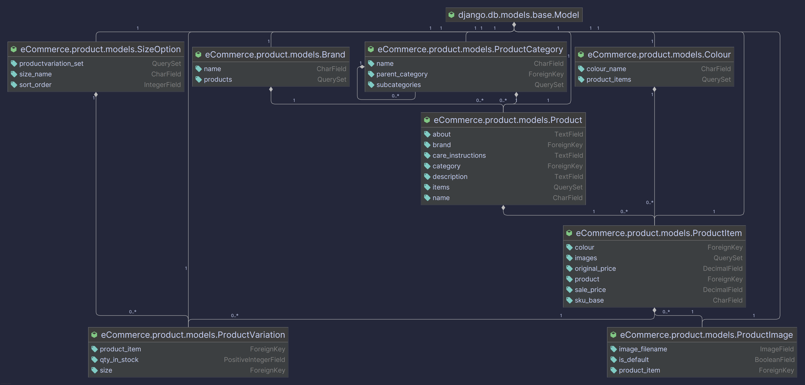

# Product Module

## Overview

The `product` module forms the core of the e-commerce catalog. It is responsible for managing all product-related data, including hierarchical categories, brands, and a multi-tiered product structure that handles variations in color and size. The module provides a highly optimized, read-only public API for customers to browse, search, and filter products.

## Data Models

The data schema is designed using a tiered approach to efficiently manage complex product variations. This structure is highly scalable and prevents data duplication.

### Model ERD (Entity-Relationship Diagram)

The following diagram illustrates the relationships between the models in this module.



> **Note:** You can generate a similar diagram for your models by installing `django-extensions` and `graphviz`, then running the command:
> `python manage.py graph_models product -o product_models_erd.png`

### Tier 1: The Abstract Product (`Product`)
This is the top-level model that contains information shared across all variations of a single product.
-   **Fields:** `name`, `description`, `care_instructions`, `about`.
-   **Relationships:** Linked via foreign key to `ProductCategory` and `Brand`.

### Tier 2: The Visual Variant (`ProductItem`)
This model represents a specific visual style of a `Product`, typically defined by its color.
-   **Fields:** `sku_base` (a unique identifier for this color variant), `original_price`, `sale_price`.
-   **Relationships:** Linked to a parent `Product` and a `Colour`.
-   **Key Feature:** It holds the price and is the anchor for `ProductImage` records, ensuring that images are correctly associated with their specific color variant (e.g., red shirt images are linked to the "Red" `ProductItem`).

### Tier 3: The Inventory Unit (`ProductVariation`)
This is the most specific, physical unit of a product, defined by its size. This is the actual item that gets added to a shopping cart.
-   **Fields:** `qty_in_stock`.
-   **Relationships:** Linked to a parent `ProductItem` (which defines its color) and a `SizeOption`.
-   **Constraint:** A `unique_together` constraint on `product_item` and `size` prevents duplicate entries (e.g., you can't have two "Red, Size M" entries for the same shirt).

### Lookup Models
-   **`ProductCategory`**: A hierarchical model that allows for nested categories (e.g., "Clothing" > "Tops" > "T-Shirts").
-   **`Brand`**: A simple table for product brands (e.g., "Nike", "Adidas").
-   **`Colour`**: A lookup table for colors.
-   **`SizeOption`**: A lookup table for sizes, with a `sort_order` field to ensure sizes are displayed in a logical order (e.g., S, M, L, XL).

## API Endpoints & Features

The public API is read-only and designed for high performance and ease of use.

| Endpoint | Method | Description | Permissions |
| --- | --- | --- | --- |
| `/api/v1/products/` | `GET` | Lists all products with full feature support. | `AllowAny` |
| `/api/v1/products/<id>/` | `GET` | Retrieves a single product with all its nested details. | `AllowAny` |
| `/api/v1/products/categories/` | `GET` | Lists all available product categories. | `AllowAny` |
| `/api/v1/products/brands/` | `GET` | Lists all available product brands. | `AllowAny` |

### Feature-Rich Product Listing (`/api/v1/products/`)
The main list endpoint is equipped with the following features:
-   **Pagination:** Responses are paginated with a default `PAGE_SIZE` of 12 to ensure fast load times.
-   **Filtering:** Users can filter results using query parameters:
    -   `category=<name>` (e.g., `?category=Footwear`)
    -   `brand=<name>` (e.g., `?brand=Nike`)
    -   `min_price=<amount>` & `max_price=<amount>` (e.g., `?min_price=50&max_price=150`)
-   **Sorting:** Results can be sorted by price or name:
    -   `ordering=price` (ascending)
    -   `ordering=-price` (descending)
    -   `ordering=name`
-   **Searching:** Full-text search is available on product `name` and `description` via the `search` parameter (e.g., `?search=running%20shoe`).

## Performance Optimizations

Performance is a critical feature of this module.
-   **Efficient Queries:** The `ProductListView` uses `annotate(price=Min('items__original_price'))` to perform price calculations at the database level, which is significantly faster than doing it in Python. This also ensures sorting is accurate.
-   **N+1 Query Prevention:** The view uses `prefetch_related('items__images')` to fetch all necessary related objects in a minimal number of queries, preventing the "N+1" problem and drastically reducing database load.
-   **Lightweight & Heavy Serializers:**
    -   `ProductListSerializer`: Used for the list view, this serializer is optimized to return only the data needed for a product grid (name, brand, lowest price, main image).
    -   `ProductDetailSerializer`: Used for the detail view, it provides the full, nested data structure for a single product.

## Testing

The module includes a comprehensive test suite in `tests.py` that validates every aspect of its functionality, including model properties, serializer outputs, and all API features (filtering, sorting, etc.).

To run the tests for this module, execute the following command:
```bash
python manage.py test product
```
