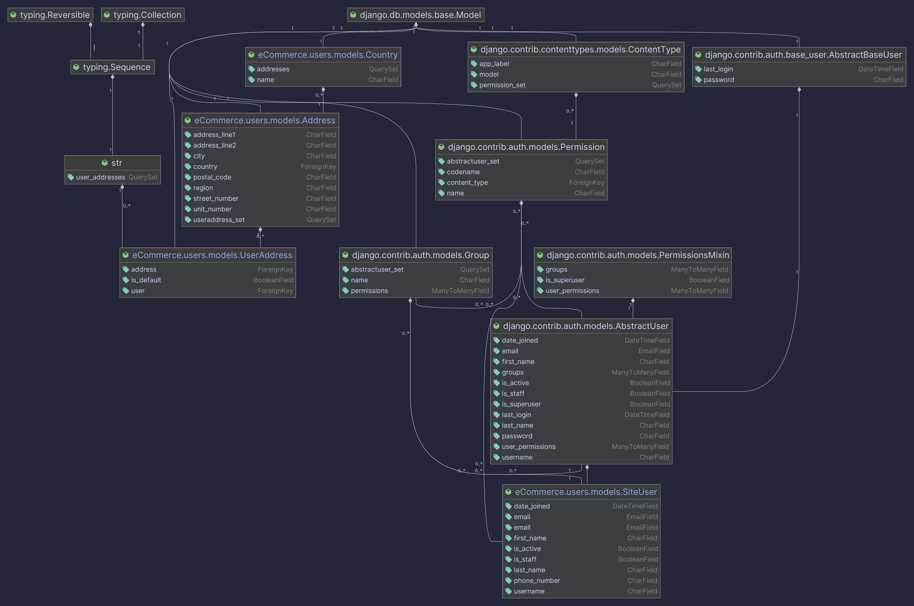

# Users Module

## Overview

The `users` module is the cornerstone of the e-commerce platform's identity and access management system. It handles all aspects of user management, including account creation, secure authentication, profile management, and physical addresses. The system is designed to be secure, scalable, and easy to integrate with other modules.

## Data Models

The data schema is designed to be robust and flexible, separating user identity from address information for reusability and clarity.

### Model ERD (Entity-Relationship Diagram)

The following diagram illustrates the relationships between the models in this module.



> **Note:** You can generate a similar diagram for your models by installing `django-extensions` and `graphviz`, then running the command:
> `python manage.py graph_models users -o user_models_erd.png`

### `SiteUser`
This is the custom user model for the entire project, inheriting from Django's `AbstractUser`.
-   **Primary Identifier:** It uses the `email` field as the unique identifier for authentication (`USERNAME_FIELD = 'email'`), which is standard for modern web applications.
-   **Email Verification:** The `is_active` flag is set to `False` by default upon creation. A user cannot log in until they verify their email address, activating their account.
-   **Profile Data:** Includes standard fields like `first_name`, `last_name`, and an optional `phone_number`.

### `Address` & `Country`
To avoid data duplication, physical addresses are stored in a decoupled `Address` model.
-   An `Address` is not directly tied to a user, making the model reusable if, for example, the business needs to store supplier addresses in the future.
-   `Country` is a simple lookup table to ensure standardized country data, linked via a foreign key.

### `UserAddress`
This is the junction (or "through") model that links a `SiteUser` to one or more `Address` records.
-   It allows a single user to have multiple addresses (e.g., "Home," "Work," "Billing").
-   It contains a crucial `is_default` boolean field. The model's `save()` method includes logic to ensure that if a new address is set as the default, all other addresses for that user are automatically unset as default.

## Authentication & Authorization

### Technology
-   **JWT (JSON Web Tokens):** Authentication is handled via JWT using the `djangorestframework-simplejwt` library. This is a stateless and secure method ideal for APIs.
-   **Token Lifespan:** Access tokens are short-lived (5 minutes) for security, while refresh tokens are long-lived (1 day) for a good user experience.
-   **Security Measures:** Refresh token rotation and blacklisting are enabled. When a refresh token is used, a new one is issued, and the old one is blacklisted, preventing token reuse in case of theft.

### Authentication Flow

1.  **Registration:** A new user signs up by sending their details to `POST /api/v1/auth/register/`. The system creates a new `SiteUser` with `is_active=False`.
2.  **Email Confirmation:** An email is dispatched to the user containing a unique, token-based confirmation link.
3.  **Activation:** The user clicks the link (`GET /api/v1/auth/confirm-email/<uid>/<token>/`), which is validated by the server. If valid, the user's account is switched to `is_active=True`.
4.  **Login:** The now-active user can log in at `POST /api/v1/token/`. The custom `CustomTokenObtainPairView` verifies their credentials and `is_active` status, returning an `access` and `refresh` token pair if successful.
5.  **Logout:** An authenticated user logs out by sending their `refresh` token to `POST /api/v1/auth/logout/`. The token is added to a blacklist, effectively invalidating the session.

## API Endpoints

All endpoints are prefixed with `/api/v1/auth/`.

| Endpoint | Method | Description | Permissions |
| --- | --- | --- | --- |
| `/register/` | `POST` | Registers a new, inactive user. | `AllowAny` |
| `/confirm-email/<uid>/<token>/` | `GET` | Activates a user's account via email link. | `AllowAny` |
| `/token/` | `POST` | Logs in an active user (part of root URLs). | `AllowAny` |
| `/token/refresh/` | `POST` | Refreshes an access token (part of root URLs). | `AllowAny` |
| `/logout/` | `POST` | Logs out a user by blacklisting their token. | `IsAuthenticated` |
| `/me/` | `GET`, `PATCH` | Retrieve or partially update the authenticated user's profile. | `IsAuthenticated` |
| `/addresses/` | `GET`, `POST` | List all of the user's addresses or create a new one. | `IsAuthenticated` |
| `/addresses/<id>/` | `GET`, `PUT`, `PATCH`, `DELETE` | Manage a specific address for the user. | `IsAuthenticated` |

## Serializers

-   **`UserRegistrationSerializer`**: Validates user input for registration, checks for password mismatch, and handles the creation of the inactive `SiteUser`.
-   **`CustomTokenObtainPairSerializer`**: Extends the default JWT serializer to add a critical check: it prevents users with `is_active=False` from logging in.
-   **`UserDetailSerializer`**: Safely exposes non-sensitive user data for profile viewing and updating.
-   **`AddressSerializer` & `UserAddressSerializer`**: Work together to handle the nested creation and display of user addresses, making the API intuitive to use.

## Testing

The module includes a comprehensive test suite in `tests.py` that provides confidence in the correctness and security of the implementation. It covers:
-   Model integrity and custom logic.
-   End-to-end API flows for the entire authentication lifecycle.
-   Permission checks and security rules.

To run the tests for this module, execute the following command:
```bash
python manage.py test users
```
